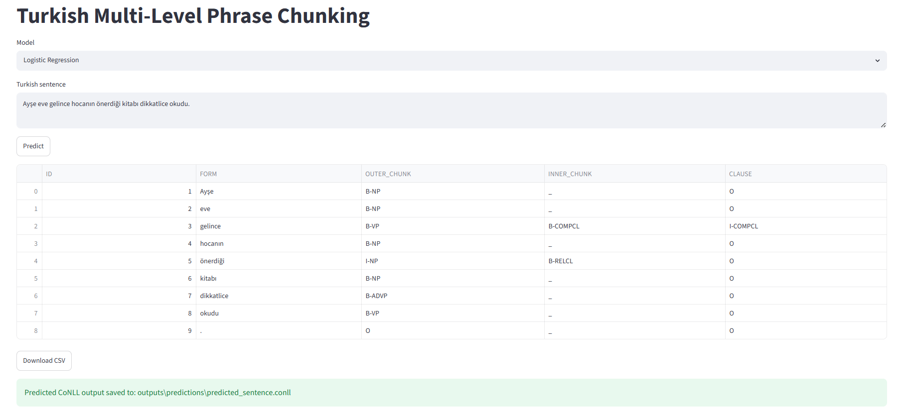
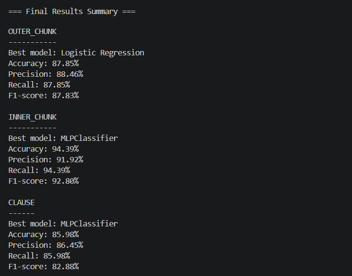
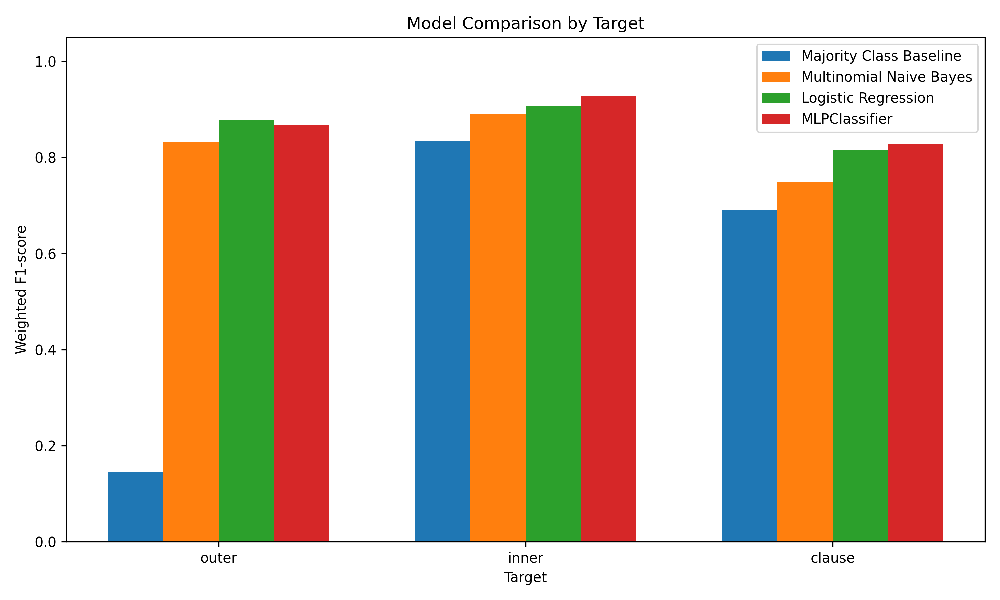
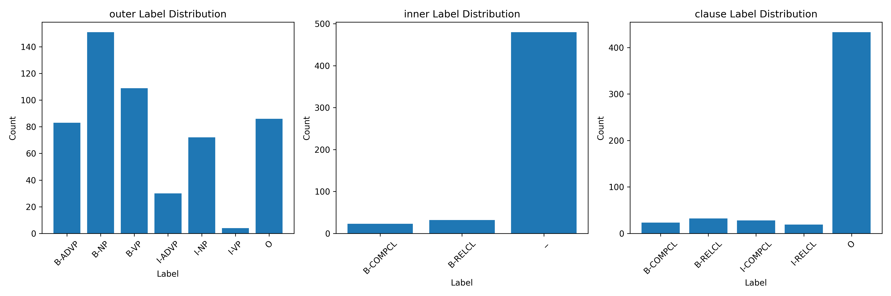
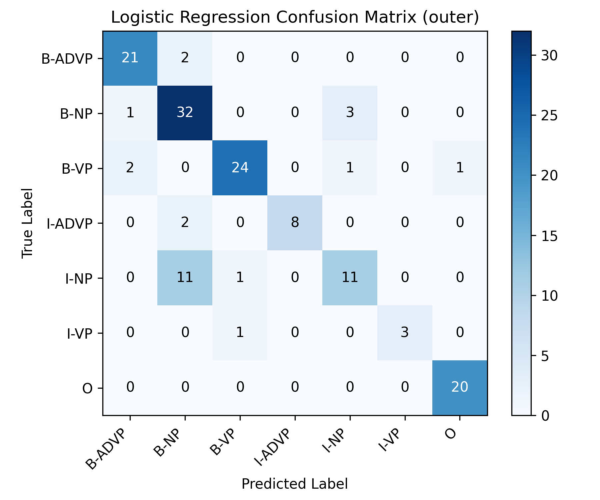
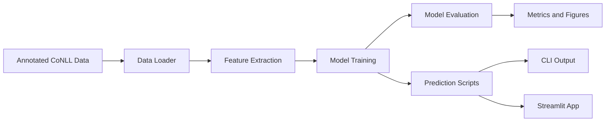
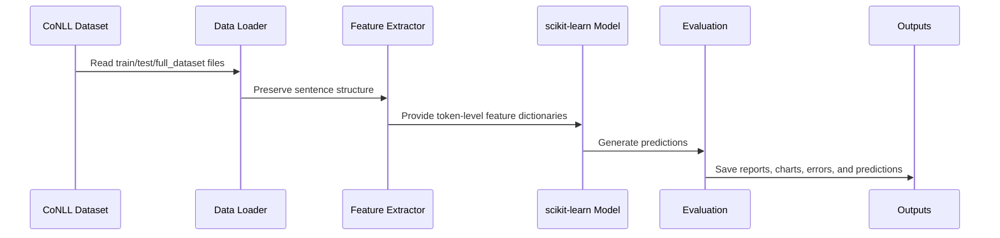

<h1 align="center">Turkish Multi-Level Phrase Chunking</h1>

<p align="center">
Classical machine learning pipeline for token-level Turkish outer chunk, inner chunk, and clause prediction.
</p>

<p align="center">
  
  
  
  
  
  
  
  
  
</p>

---

## Project Overview

This project is a Natural Language Processing course project focused on **Turkish multi-level phrase chunking** using classical machine learning methods.

The system reads Turkish sentences in CoNLL format and predicts three token-level labels:

| Target | Description |
| --- | --- |
| `OUTER_CHUNK` | Main phrase chunks such as noun phrases, verb phrases, and adverbial phrases |
| `INNER_CHUNK` | Embedded relative and complement clause indicators |
| `CLAUSE` | Clause-level relative and complement clause boundaries |

The project intentionally avoids transformers, BERT, large language models, and deep contextual embeddings. Instead, it uses handcrafted token features and scikit-learn classifiers to create an interpretable and course-appropriate NLP pipeline.

The end-to-end workflow includes:

```text
CoNLL Dataset -> Data Loader -> Feature Extraction -> Classical ML Models
              -> Evaluation -> Visualizations -> CLI / Streamlit Prediction
```

---

## Interface Preview

### Streamlit Prediction Interface

The Streamlit app allows users to enter a Turkish sentence, choose a trained model, and inspect token-level predictions in a table.



---

### Final Results Summary

The full pipeline prints the best-performing model for each target and saves the same readable summary to `outputs/metrics/final_results_summary.txt`.



---

### Model Comparison

All required classical machine learning models are compared across the three prediction targets.



---

### Label Distribution

The project includes a label distribution chart to make annotation coverage and class imbalance easier to inspect.



---

### Confusion Matrix

Confusion matrices are generated for the evaluation targets. The example below shows the `OUTER_CHUNK` confusion matrix.



---

## Key Features

### CoNLL Data Processing

The data loader supports a clean CoNLL-style annotation format:

```text
ID FORM OUTER_CHUNK INNER_CHUNK CLAUSE
```

Supported behavior:

* Sentence separation with blank lines
* Comment lines starting with `#`
* Clear error messages for malformed rows
* Sentence-level structure preservation
* Compatibility with `train.conll`, `test.conll`, and `full_dataset.conll`

### Token-Level Feature Extraction

The feature extractor uses interpretable token-level features:

* Surface form and lowercase form
* Prefixes and suffixes
* Token length
* Capitalization, uppercase, digit, and punctuation indicators
* Previous and next token context
* First-token and last-token indicators
* Simple Turkish suffix cues

These features are designed to keep the system understandable while still giving classical models enough linguistic signal.

### Multi-Target Prediction

The project trains and evaluates models separately for:

* Outer chunk prediction
* Inner chunk prediction
* Clause prediction

This makes it possible to compare which models work best for different linguistic levels.

### Classical Machine Learning Models

The implemented models are:

| Model | Role |
| --- | --- |
| Majority Class Baseline | Reference baseline using the most frequent label |
| Multinomial Naive Bayes | Lightweight probabilistic model |
| Logistic Regression | Strong sparse-feature linear model |
| MLPClassifier | scikit-learn feed-forward classifier |

Conditional Random Fields (CRF) are intentionally not part of the main required system. CRF can be added later as an optional bonus sequence-labeling extension.

### Evaluation and Analysis

The project automatically generates:

* Accuracy, precision, recall, and F1-score
* Classification reports
* Confusion matrix PNG files
* Model comparison CSV
* Model comparison chart
* Label distribution chart
* Error analysis CSV files
* Predicted CoNLL output for new sentences

---

## Dataset

The annotated dataset is located in `data/annotated/`.

| File | Description |
| --- | --- |
| `full_dataset.conll` | Full manually prepared Turkish dataset |
| `train.conll` | Training split |
| `test.conll` | Test split |

Current dataset size:

| Split | Sentences | Tokens |
| --- | ---: | ---: |
| Train | 80 | 535 |
| Test | 20 | 144 |
| Full Dataset | 100 | 679 |

Supported labels:

| Target | Labels |
| --- | --- |
| `OUTER_CHUNK` | `B-NP`, `I-NP`, `B-VP`, `I-VP`, `B-ADVP`, `I-ADVP`, `O` |
| `INNER_CHUNK` | `B-RELCL`, `I-RELCL`, `B-COMPCL`, `I-COMPCL`, `_` |
| `CLAUSE` | `B-RELCL`, `I-RELCL`, `B-COMPCL`, `I-COMPCL`, `O` |

Example annotation:

```text
# text = Ayşe eve gelince hocanın önerdiği kitabı dikkatlice okudu.
1 Ayşe B-NP _ O
2 eve B-NP _ O
3 gelince B-VP B-COMPCL I-COMPCL
4 hocanın B-NP _ O
5 önerdiği B-VP B-RELCL I-RELCL
6 kitabı B-NP _ O
7 dikkatlice B-ADVP _ O
8 okudu B-VP _ O
9 . O _ O
```

More details about the dataset and annotation conventions are provided in [`data/README_DATA.md`](data/README_DATA.md).

---

## Results

The final model comparison selects the best model separately for each prediction target.

| Target | Best Model | Accuracy | Precision | Recall | F1-score |
| --- | --- | ---: | ---: | ---: | ---: |
| `OUTER_CHUNK` | Logistic Regression | 87.85% | 88.46% | 87.85% | 87.83% |
| `INNER_CHUNK` | MLPClassifier | 94.39% | 91.92% | 94.39% | 92.80% |
| `CLAUSE` | MLPClassifier | 85.98% | 86.45% | 85.98% | 82.88% |

The default evaluation stage evaluates Logistic Regression models on the held-out `test.conll` split:

| Target | Accuracy | Precision | Recall | F1-score |
| --- | ---: | ---: | ---: | ---: |
| `OUTER_CHUNK` | 82.64% | 83.61% | 82.64% | 82.19% |
| `INNER_CHUNK` | 93.06% | 92.31% | 93.06% | 91.59% |
| `CLAUSE` | 84.03% | 83.23% | 84.03% | 80.60% |

The model comparison stage evaluates all required models and writes detailed outputs to `outputs/metrics/` and `outputs/figures/`.

---

## Architecture

The project is organized as a modular NLP pipeline.



### Data Flow



---

## Project Structure

```text
Turkish_Multi_Level_Phrase_Chunking/
│── README.md
│── LICENSE
│── main.py
│── requirements.txt
├── app/
│   └── streamlit_app.py
├── assets/
│   └── screenshots/
├── data/
│   ├── raw/
│   ├── annotated/
│   │   ├── full_dataset.conll
│   │   ├── train.conll
│   │   └── test.conll
│   └── README_DATA.md
├── models/
├── outputs/
│   ├── figures/
│   ├── metrics/
│   └── predictions/
├── report/
│   └── project_report_Turkish.pdf
└── src/
    ├── data_loader.py
    ├── error_analysis.py
    ├── evaluate.py
    ├── features.py
    ├── predict.py
    ├── train.py
    └── utils.py
```

---

## Technologies Used

| Category | Technology |
| --- | --- |
| Programming Language | Python |
| Machine Learning | scikit-learn |
| Data Handling | pandas, NumPy |
| Model Serialization | joblib |
| Visualization | matplotlib, seaborn |
| Web Interface | Streamlit |
| Dataset Format | CoNLL-style token annotation |
| Task Type | Token classification |

---

## Installation and Running

### 1. Clone Repository

```bash
git clone https://github.com/AFurkanOcel/Turkish_Multi_Level_Phrase_Chunking.git
cd Turkish_Multi_Level_Phrase_Chunking
```

### 2. Create Virtual Environment

```bash
python -m venv .venv
```

Activate on Windows:

```bash
.venv\Scripts\activate
```

### 3. Install Dependencies

```bash
pip install -r requirements.txt
```

### 4. Run Full Pipeline

```bash
python main.py
```

This command runs:

* Data loading
* Feature extraction
* Model training
* Model comparison
* Evaluation
* Prediction output generation
* Error analysis
* Final results summary

### 5. Train Models Manually

Train all models for all targets:

```bash
python src/train.py --target all --model all
```

Train a specific target with the default Logistic Regression model:

```bash
python src/train.py --target outer
python src/train.py --target inner
python src/train.py --target clause
```

### 6. Evaluate Models

```bash
python src/evaluate.py --target outer
python src/evaluate.py --target inner
python src/evaluate.py --target clause
```

### 7. Run CLI Prediction

```bash
python src/predict.py --sentence "Ayşe eve gelince hocanın önerdiği kitabı dikkatlice okudu."
```

### 8. Run Streamlit App

```bash
streamlit run app/streamlit_app.py
```

If the `streamlit` command is not recognized on Windows, use:

```bash
python -m streamlit run app/streamlit_app.py
```

---

## Generated Outputs

| Output | Location |
| --- | --- |
| Saved trained models | `models/` |
| Model comparison table | `outputs/metrics/model_comparison.csv` |
| Final summary text file | `outputs/metrics/final_results_summary.txt` |
| Classification reports | `outputs/metrics/` |
| Error analysis files | `outputs/metrics/error_analysis_*.csv` |
| Confusion matrices | `outputs/figures/` |
| Model comparison chart | `outputs/figures/model_comparison.png` |
| Label distribution chart | `outputs/figures/label_distribution.png` |
| Predicted CoNLL sentence | `outputs/predictions/predicted_sentence.conll` |
| Turkish project report | `report/project_report_Turkish.pdf` |

---

## Design Notes

The project is designed for an academic NLP setting, so the implementation prioritizes:

* Transparent preprocessing
* Interpretable feature engineering
* Classical machine learning baselines
* Reproducible command-line workflows
* Clear evaluation artifacts
* Practical error analysis
* A small but usable Streamlit demonstration interface

This makes the system easier to explain, defend, and extend compared with a black-box transformer-based solution.

---

## Limitations and Future Improvements

Current limitations:

* The dataset is course-project sized and manually annotated.
* Turkish morphology is represented with simple suffix features rather than a full morphological analyzer.
* Sequence dependencies are approximated with neighboring-token features.
* Some rare labels may still be difficult for classical models due to limited examples.

Possible future improvements:

* Add CRF as an optional sequence-labeling bonus model.
* Expand the dataset with more naturally occurring Turkish sentences.
* Add morphological analysis features.
* Add cross-validation for more stable model comparison.
* Add per-label error summaries to the Streamlit interface.
* Add a more detailed experimental appendix for larger future datasets.

---

## Learning Outcomes

This project demonstrates:

* CoNLL-style dataset design for Turkish NLP
* Token-level feature extraction
* Multi-target token classification
* Classical machine learning model comparison
* Evaluation with accuracy, precision, recall, F1-score, and confusion matrices
* Error analysis for incorrect token predictions
* CLI and Streamlit deployment of a small NLP system
* The effect of annotation consistency and dataset balance on model quality

---

## Author

**A. Furkan ÖCEL**

---

## License

This project is licensed under the terms included in the repository's `LICENSE` file.
