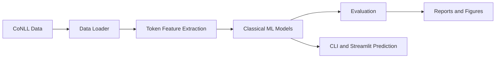

# Turkish Multi-Level Phrase Chunking

<div align="center">

**A classical machine learning NLP project for token-level Turkish phrase chunking, inner chunk detection, and clause prediction.**


</div>

## Project Overview

This repository contains a Natural Language Processing course project that predicts three token-level labels for Turkish sentences:

- **OUTER_CHUNK**: phrase-level chunk labels such as noun phrases, verb phrases, and adverbial phrases.
- **INNER_CHUNK**: embedded clause indicators for relative and complement clauses.
- **CLAUSE**: clause-level boundaries for relative and complement clause structures.

The project is intentionally built with **classical machine learning methods**. It does not use BERT, transformers, large language models, or neural sequence models. The goal is to demonstrate a complete, interpretable, and reproducible NLP pipeline using handcrafted token features and scikit-learn classifiers.

## Interface Preview

### Streamlit Prediction Interface

The Streamlit interface allows users to enter a Turkish sentence, select a trained model, and view token-level predictions in a table.


### Final Results Summary

The main pipeline prints the best model for each target and saves the same summary under `outputs/metrics/final_results_summary.txt`.


### Model Comparison

The project compares all required models across the three prediction targets.


### Label Distribution

The dataset label distribution is visualized to make class balance and annotation coverage easier to inspect.


### Confusion Matrix Example

Confusion matrices are generated for each target. The example below shows the outer chunk evaluation.


## Key Features

- CoNLL-style dataset reader with sentence-level structure preservation.
- Support for comment lines and blank-line sentence boundaries.
- Clear validation errors for malformed CoNLL rows.
- Token-level feature extraction for Turkish text.
- Classical machine learning models implemented with scikit-learn.
- Separate training support for `outer`, `inner`, and `clause` targets.
- Model comparison across four model families.
- Accuracy, precision, recall, F1-score, and classification report outputs.
- Confusion matrix generation as PNG files.
- Label distribution visualization.
- Error analysis CSV files for incorrect predictions.
- Predicted CoNLL output generation.
- Command-line prediction script.
- Streamlit web interface for interactive prediction.
- Modular project structure suitable for an NLP course submission.

## Task Definition

Each sentence is represented in a CoNLL-style format with one token per line:

```text
ID FORM OUTER_CHUNK INNER_CHUNK CLAUSE
```

Example:

```text
# text = Ayşe eve gelince hocanın önerdiği kitabı dikkatlice okudu.
1 Ayşe B-NP _ O
2 eve B-NP _ O
3 gelince B-VP B-COMPCL I-COMPCL
4 hocanın B-NP _ O
5 önerdiği B-VP B-RELCL I-RELCL
6 kitabı B-NP _ O
7 dikkatlice B-ADVP _ O
8 okudu B-VP _ O
9 . O _ O
```

The system predicts all three target columns for unseen Turkish sentences.

## Dataset

The annotated dataset is stored under `data/annotated/`.

| File | Purpose |
| --- | --- |
| `full_dataset.conll` | Full annotated dataset |
| `train.conll` | Training split |
| `test.conll` | Test split |

Current dataset size:

| Split | Sentences | Tokens |
| --- | ---: | ---: |
| Train | 80 | 535 |
| Test | 20 | 144 |
| Full Dataset | 100 | 679 |

Supported labels:

| Target | Labels |
| --- | --- |
| `OUTER_CHUNK` | `B-NP`, `I-NP`, `B-VP`, `I-VP`, `B-ADVP`, `I-ADVP`, `O` |
| `INNER_CHUNK` | `B-RELCL`, `I-RELCL`, `B-COMPCL`, `I-COMPCL`, `_` |
| `CLAUSE` | `B-RELCL`, `I-RELCL`, `B-COMPCL`, `I-COMPCL`, `O` |

Detailed dataset documentation is available in [`data/README_DATA.md`](data/README_DATA.md).

## Feature Extraction

The project uses handcrafted token-level features, including:

- surface form and lowercase form
- prefixes and suffixes
- capitalization, uppercase, digit, and punctuation indicators
- token length
- previous and next token context
- first-token and last-token indicators
- simple Turkish suffix cues

These features are extracted sentence by sentence and then flattened for scikit-learn training.

## Models

The following classical machine learning models are implemented:

| Model | Purpose |
| --- | --- |
| Majority Class Baseline | Simple baseline using the most frequent class |
| Multinomial Naive Bayes | Lightweight probabilistic classifier |
| Logistic Regression | Strong linear baseline for sparse token features |
| MLPClassifier | Feed-forward classical neural classifier from scikit-learn |

Conditional Random Fields (CRF) are not part of the main system. CRF can be added later as an optional bonus extension.

## Results

The final model comparison selects the best model separately for each prediction target:

| Target | Best Model | Accuracy | Precision | Recall | F1-score |
| --- | --- | ---: | ---: | ---: | ---: |
| OUTER_CHUNK | Logistic Regression | 87.85% | 88.46% | 87.85% | 87.83% |
| INNER_CHUNK | MLPClassifier | 94.39% | 91.92% | 94.39% | 92.80% |
| CLAUSE | MLPClassifier | 85.98% | 86.45% | 85.98% | 82.88% |

The default held-out evaluation stage evaluates Logistic Regression models on `test.conll`:

| Target | Accuracy | Precision | Recall | F1-score |
| --- | ---: | ---: | ---: | ---: |
| OUTER_CHUNK | 82.64% | 83.61% | 82.64% | 82.19% |
| INNER_CHUNK | 93.06% | 92.31% | 93.06% | 91.59% |
| CLAUSE | 84.03% | 83.23% | 84.03% | 80.60% |

Output files are written under `outputs/metrics/`, `outputs/figures/`, and `outputs/predictions/`.

## Project Structure

```text
Turkish_Multi_Level_Phrase_Chunking/
|-- app/
|   `-- streamlit_app.py
|-- assets/
|   `-- screenshots/
|-- data/
|   |-- raw/
|   |-- annotated/
|   |   |-- full_dataset.conll
|   |   |-- train.conll
|   |   `-- test.conll
|   `-- README_DATA.md
|-- models/
|-- outputs/
|   |-- figures/
|   |-- metrics/
|   `-- predictions/
|-- report/
|   `-- project_report.md
|-- src/
|   |-- data_loader.py
|   |-- error_analysis.py
|   |-- evaluate.py
|   |-- features.py
|   |-- predict.py
|   |-- train.py
|   `-- utils.py
|-- main.py
|-- requirements.txt
`-- README.md
```

## Installation

Clone the repository:

```bash
git clone https://github.com/AFurkanOcel/Turkish_Multi_Level_Phrase_Chunking.git
cd Turkish_Multi_Level_Phrase_Chunking
```

Create and activate a virtual environment:

```bash
python -m venv .venv
.venv\Scripts\activate
```

Install dependencies:

```bash
pip install -r requirements.txt
```

If the `streamlit` command is not recognized on Windows, use:

```bash
python -m streamlit run app/streamlit_app.py
```

## Usage

Run the complete pipeline:

```bash
python main.py
```

Train all models for all targets:

```bash
python src/train.py --target all --model all
```

Train a specific target:

```bash
python src/train.py --target outer
python src/train.py --target inner
python src/train.py --target clause
```

Evaluate trained models:

```bash
python src/evaluate.py --target outer
python src/evaluate.py --target inner
python src/evaluate.py --target clause
```

Run command-line prediction:

```bash
python src/predict.py --sentence "Ayşe eve gelince hocanın önerdiği kitabı dikkatlice okudu."
```

Run the Streamlit app:

```bash
streamlit run app/streamlit_app.py
```

Alternative Windows command:

```bash
python -m streamlit run app/streamlit_app.py
```

## Generated Outputs

| Output | Location |
| --- | --- |
| Saved models | `models/` |
| Model comparison CSV | `outputs/metrics/model_comparison.csv` |
| Final summary | `outputs/metrics/final_results_summary.txt` |
| Classification reports | `outputs/metrics/` |
| Error analysis CSV files | `outputs/metrics/error_analysis_*.csv` |
| Confusion matrices | `outputs/figures/` |
| Model comparison chart | `outputs/figures/model_comparison.png` |
| Label distribution chart | `outputs/figures/label_distribution.png` |
| Predicted CoNLL output | `outputs/predictions/predicted_sentence.conll` |

## Methodology

The pipeline follows a standard supervised token classification workflow:



## Learning Outcomes

This project demonstrates:

- how to design a CoNLL-style dataset for Turkish NLP
- how to extract interpretable token-level features
- how to train classical machine learning models for token classification
- how to evaluate models with both numeric metrics and visual diagnostics
- how data quality and label consistency affect NLP model behavior
- how to package an NLP pipeline with CLI scripts and a simple web interface

## Limitations and Future Work

- The dataset is course-project sized and manually constructed.
- Turkish morphology is represented with simple suffix cues rather than a full morphological analyzer.
- Sequence dependencies are modeled indirectly through neighboring-token features.
- CRF can be added later as an optional sequence-labeling bonus model.
- Larger annotated datasets would improve generalization.

## Author

Developed by **Abdulkadir Furkan Öcel** as a Natural Language Processing course project.
